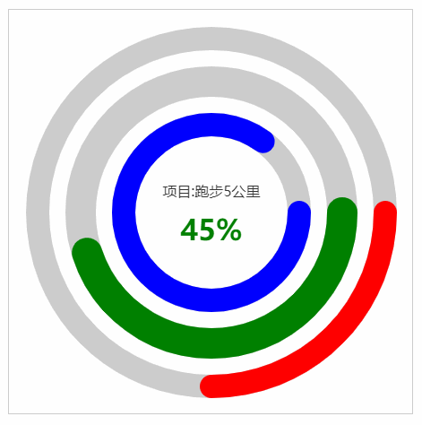
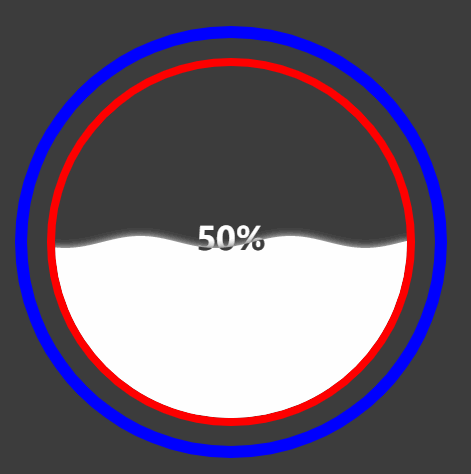

# charts
Some commonly used charts;一些常用的图表，自己实现的。

## 背景
- 项目中经常会使用echarts，这里感谢`echarts`如此好的图表库
- 但有些图表，echarts中没有或者不好实现
- 但是也时常需要其它图表，所以有了此库。

## Example(网页示例)
- [Demo](https://one-boy.github.io/charts/example/index.html)

## 已有图表
- **活动占比图**

- **水球占比图**

## 目录介绍
- `./src`，存放源代码
- `./build`，存放打包后的代码，可直接引入
- `./example`，例子

## 编译方法
- `npm run build`

## 环境依赖
- 无其它库依赖，需浏览器支持canvas

## 图表使用方法
- 1.引入build下的`charts.js`
- 2.全局变量为`MyCharts`
- 3.按照如下方法使用：
#### 活动占比图使用示例：

点击查看

<pre>
const data = [
    { name: '跑步1公里', value: 85, baseValue: 100 },
    { name: '跑步5公里', value: 45, baseValue: 100 },
    { name: '跑步8公里', value: 25, baseValue: 100 },
  ]
  const options = {
    data,
    textStyle: {
      //主标题
      title: {
        fontFamily: 'sans-serif',
        fontSize: 16,
        color: '#333',
        fontWeight: 'normal',
        formatter: '项目:{name}',  //内容格式器
      },
      // 副标题
      subTitle: {
        fontFamily: 'sans-serif',
        fontSize: 32,
        color: 'auto',  //color为auto时，标题颜色和环的颜色相同
        fontWeight: 'bold',
        formatter: '{percent}%',  //内容格式器
      },
    },
    //其它样式
    itemStyle: {
      lineCap: 'round',  //线头样式
      arcGap: 22,  // 环与环的间隙
      innerRadius: 50,  //内环半径
      width: 26,  //环的宽度
      bottomColor: '#ccc',  //环底色
    },
    //颜色映射,和data的value作比对
    visualMap: [
      { min: 0, max: 35, color: 'red' },
      { min: 34, max: 74, color: 'green' },
      { min: 75, max: 100, color: 'blue' },

    ],
  }

  const containerDom = document.getElementById('container')

  //初始化，传入容器dom
  const act = new MyCharts.Activity(containerDom)

  //加入配置
  act.setOption(options)

  //启动轮播
  act.startCarousel(2000)
</pre>

#### 水球占比图示例

点击查看

<pre>
  // 数据
  const WATER_DATA = {
    value: 50,
  }

  // 活动图的配置
  const options = {
    //活动图的数据
    data: WATER_DATA,
    // 文本样式
    textStyle: {
      font: 'sans-serif',
      fontSize: 32,
      color: 'white',
      fontWeight: 'bold',
      formatter: '{value}%',
      globalCompositeOperation: 'xor',
    },
    // 其它项目样式
    itemStyle: {
      // 动画时间
      animationTime: 3000,
      // 波浪相关样式
      wave: {
        color: 'rgb(255,255,255)',  // 颜色
        waterCycle: 150, // 单波宽
        waterHeight: 6, // 波高
        waveOffsetRange: 0.1, // 频率
      },
      // 内环样式
      innerCircle: {
        width: 8,
        color: 'red',
        radius: 180, // 半径
      },
      // 外环样式
      outterCircle: {
        width: 12,
        color: 'blue',
        radius: 210,
      },
    }
  }

  const arc = new MyCharts.WaterWave('box')
  arc.setOption(options)
</pre>

## License

- MIT
